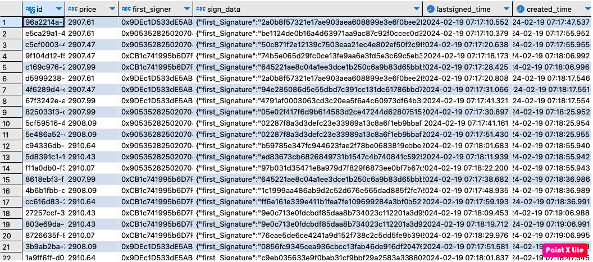

# Go with GOSSIP-PRICE SYSTEM

This repository demonstrates how to build and deploy distributed system using libP2p library.

## Requirements
- It will work with distributed gossiping nodes
- Each nodes signs and re-emit(pulls) the price message to network
- If the message is signed with 3 signers, then it will be stored in Postgres
- Must be stored in Postgres after 30 seconds from last signed
- The price will be taken from coinbase API every 10 minutes

## Infrastructure of the network

- Postgres database: It's for storing signed data. Every node can access and write the data if it meets requirements
- Bootstrap node: This is bootstrap node for responsible to provide newly joining nodes into the network.
- Gossip node: This is responsible for receive/sign/pull the price message. Each node find the another node and bootstrap based on DHT(distributed hash table) algorithms.

## Consensus of the network

The consensus of this network is when store the data to Postgres database. We start with fetching the price from coinbase API and sign with node private key using ECDSA
and re-emit to network. When receive the message from other node, check if this message already signed by this signer and do it if not signed yet.
After signed message, it will stored in cache memory of the node. And check if the more than 3 signers signed for this message and if so the message will
be moved to verified list. Every 30 seconds we check if there is verified data to store database and execute the insert sql.

### Technology Choices

1. libp2p library for implementing distributed gossip system. 

   ```bash
   go install github.com/libp2p/go-libp2p-kad-dht
   ```
2. PostgreSQL database for storing signed data. This is the table description.

   Columns | Comment 
   --- | --- | 
   id | This shows each price message id
   price | The USD price of ETH
   first_signer | The first signer of the price message
   sign_data | Json string to show signers and signatures
   lastsigned_time | Last signed date time to calculate passing time
   created_time | Created column date time
3. Coinbase API to fetch ETH USD price
   ```bash
   https://api.coinbase.com/v2/exchange-rates?currency=ETH
   ```

## Project Structure
- `consensus` - This is where the engine logic which also includes database management.
- `global` - This is where global constants, errors, fetch price management.
- `gossip` - This is where implemented distributed system infrastructure using libp2p library.
- `node` - This is where for manage each node(new, start, broadcast, receive).
- `migrations` - this is where the **schema.hcl** file lives.  Modify this file to alter the database.

## Quick Start
Make sure you have Docker installed...
And execute the docker compose command to run on docker.

```bash
docker-compose -f docker-compose.yaml up -d
```

### Environment Variables and Config

- GP_BOOTSTRAP: This is for identify current node is bootstrap or gossip node.
- GP_DATABASEURL: PostgreSQL url for access database.
- GP_CONNECTIONADDR: Node address for publishing to network.
- GP_BOOTSTRAPADDR: Bootstrap address for connect from gossip node.
- GP_MINIMUMSIGNERCOUNT: Minimum signer account for consensus.
- GP_FETCHPRICEINTERVAL: Fetch price interval.

## Security issues and improvements
- We check from database if same message id already registered before insert. This will increase request to database as the number of nodes increases.
  We can solve this problem without access database using merkle tree so can reduce the requests to database.
- We have to restrict of accessing to our bootstrap node. If you want to create node we have to build another bootstrap and create new organization.
- We have to implement the monitoring system to maintain the connection of each node.
- We have to implement the node distributed monitoring system to maintenance node receiving counts.


